# Session 01: The Software Stack - Full Contents

This is the complete version of the first lecture: the argument in full sentences, the diagrams, the demos with their reference output, and the reading behind each part.

Read it before the lecture if you want to follow the live delivery without taking notes, and after it for everything that was said once and quickly.
The one-page plan used during the lecture is [`01-software-stack-live/`](../01-software-stack-live).

## Learning objectives

By the end of this lecture you should be able to:

* Name the layers between a running application and the hardware, and say what each of them provides to the layer above.
* Explain what an interface is, and distinguish the four kinds a software component can expose: a user interface, a library API, a system call API, and a protocol.
* Describe what an operating system is for, in terms of management, arbitration and system services, and name the categories of system call it offers.
* Argue about where in the stack a given piece of software should be written, in terms of concrete trade-offs rather than taste.
* Tell an application from a library, and explain why the distinction is about entry points and interfaces rather than about file formats.
* Explain how separate applications interact, and why a protocol is a harder interface to design than a function signature.

## What is here

| Part | What it answers | Demos |
| --- | --- | --- |
| [00. Pitch](#00-pitch-four-small-surprises) | Why should a programmer care what is underneath? | [`00-pitch/`](demos/00-pitch) |
| [01. Lecture map](#01-lecture-map) | What are we doing for the next hundred minutes? | -- |
| [02. The software stack](#02-the-software-stack) | What are the layers, and what does each one give you? | [`02-software-stack/`](demos/02-software-stack) |
| [03. The operating system](#03-the-operating-system) | What is the kernel, and how do you talk to it? | [`02-software-stack/`](demos/02-software-stack) |
| [04. Trade-offs](#04-trade-offs-what-a-layer-costs-you) | What do you give up by moving up or down? | [`04-versus/`](demos/04-versus) |
| [05. Applications and libraries](#05-applications-and-libraries) | What kinds of software component are there? | -- |
| [06. Interaction](#06-interaction-between-software-components) | How do separate components talk to each other? | [`06-software-interaction/`](demos/06-software-interaction) |
| [07. Conclusion](#07-conclusion) | What should survive the week? | -- |

The slides are in [`slides/`](slides); the demos, with build instructions and reference output, are in [`demos/`](demos).

## 00. Pitch: Four Small Surprises

Before any definitions, four programs.
Each of them is short enough to read in half a minute, and each does something the source code does not explain.

### Two ways to build the same string

Two C programs assemble `John, Paul, George, Joel` ten million times.
One uses `strcat()` four times; the other uses `strcpy()` at offsets it already knows.
They print the same string, and one takes thirty times longer.

```text
$ ./copy-string
result: 'John, Paul, George, Joel'
time passed: 309604 microseconds

$ ./copy-string-improved
result: 'John, Paul, George, Joel'
time passed: 10475 microseconds
```

Nothing in the C standard says `strcat()` is slow, and glibc's implementation is a hand-tuned piece of vectorised assembly.
It loses anyway, because a C string does not carry its length, so `strcat()` has to find the end of the destination before it can write, and the destination keeps getting longer.
The cost is in the *interface*, and no implementation can optimise it away.

Full write-up: [`demos/00-pitch/01-copy-string/`](demos/00-pitch/01-copy-string).

### One character of difference, and a crash

```c
char *str = "*Hello!";	/* crashes on str[0] = ... */
char str[] = "*Hello!";	/* works */
```

The first points at a string literal, which the compiler put among the program's constants, which the linker placed in a read-only segment, which the kernel mapped without write permission, which makes the hardware refuse the store.
The second copies those eight bytes onto the stack, which is writable.

Four layers had to cooperate to produce a segmentation fault, and C's only comment on the matter is that the behaviour is undefined.

Full write-up: [`demos/00-pitch/02-const-char-init/`](demos/00-pitch/02-const-char-init).

### The same command, three times, fifteen times faster

```console
\time -v find /usr/share > /dev/null    # 2.66 s
\time -v find /usr/share > /dev/null    # 0.18 s
\time -v find /usr/share > /dev/null    # 0.15 s
```

The command is identical, the filesystem is identical, and the program issues the same system calls each time.
What changed is that the kernel kept what it read in the page cache, so the second run never touches the disk.
A program's running time is not a property of the program.

Full write-up: [`demos/00-pitch/03-find-buffer-cache/`](demos/00-pitch/03-find-buffer-cache).

### An assignment that does nothing, and changes the complexity

Building a Python string one character at a time is O(N).
Add a line that assigns the string to a variable nobody reads, and the same loop becomes O(N²).

```python
keep = s            # never used again
s = s + "a"
```

Python strings are immutable, so `s + "a"` must allocate and copy -- except that CPython notices when the old string has one reference left and quietly resizes it in place instead.
The extra reference takes the shortcut away.
The fast behaviour was never part of the language; it was an optimisation in one implementation, and it is invisible in the source.

Full write-up: [`demos/00-pitch/04-python-string-edit/`](demos/00-pitch/04-python-string-edit).

### What the four have in common

None of them is a puzzle about C or about Python.
Each is a question about the layer *below* the one the program is written in: the standard C library, the linker and the loader, the kernel's page cache, the interpreter's memory management.
In every case the source code says exactly what the program asks for and nothing at all about what it costs.

That is not a flaw in the layers.
It is the whole point of them: a layer is useful precisely because you can use it without knowing how it works.
But "you do not need to know how it works" and "you do not need to know it is there" are different claims, and only the first one is true.

The comparisons are worn but they are worn because they fit.
A Formula 1 driver does not build engines, and would be a worse driver for not knowing what an engine does to tyre temperature.
A structural engineer does not smelt steel, and still has to know how a bolted joint fails.
Being a level up from the details is the normal condition of engineering; being *unaware* of the level below is what turns a surprising measurement into an unsolvable mystery.

> **Takeaway.**
> You do not need to know everything that is under you.
> You need to know that something is under you, roughly what it does, and where to look when the numbers stop making sense.

## 01. Lecture Map

The rest of the lecture is five questions.

1. **What are the layers?**
   From the instruction set up to a web framework, what sits on what, and what each layer adds.
1. **What is the operating system?**
   What it manages, what it arbitrates, what services it offers, and how a program asks for them.
1. **What does a layer cost?**
   Five trade-offs that decide how high in the stack a piece of software should be written.
1. **What kinds of component are there?**
   Applications and libraries, and why the difference is about entry points rather than about file types.
1. **How do components interact?**
   Interfaces between separate programs: user interfaces, APIs and protocols.

## 02. The Software Stack

### Hardware does little; users want a lot

Hardware offers a small, fixed set of operations.
A processor can move a word, add two of them, compare and branch; a disk controller can read and write blocks; a network card can put a frame on a wire.
That is the whole vocabulary, and it never changes for the lifetime of the chip.

What people want is a video call, a document that autosaves, a game, a shop.
The distance between those two lists is enormous, and everything in the distance is software.

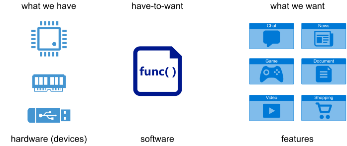

Software is what bridges the gap, and it has two properties that hardware does not: it can be changed after it is built, and it can be reused without being rebuilt.
Those two properties are why the bridge is made of software rather than of more hardware, and they are also why the bridge is built in layers rather than in one piece.

| Hardware | Software |
| --- | --- |
| does one thing, does it well | flexible, general |
| fast and efficient | featureful |
| fixed once manufactured | installable, updatable, configurable |
| physical, one instance at a time | virtual, copied for free |
| monolithic | composable, replaceable |

### The layers


Bottom to top:

* **Hardware**, exposing an **ISA** (instruction set architecture): x86-64, ARM64, RISC-V.
  This is an interface like any other in this diagram, and it is the only one the other layers cannot change.
* **The operating system**, which turns one machine into something many programs can share, and turns dozens of different devices into a handful of uniform abstractions.
  It exposes the **system call API**.
* **libc**, the standard C library, which wraps the system call API in something a C program can use, and adds everything the kernel deliberately does not do: formatted output, buffering, string and memory functions, `malloc()`, locales, time handling.
  It exposes the **C API** -- ANSI/ISO for the portable part, POSIX for the UNIX part.
* **Language runtimes and libraries**: the CPython interpreter, the JVM, the Go runtime, the C++ standard library, and the ecosystem of libraries around each.
  These expose **language APIs**.
* **Frameworks**: Flask, Django, Spring, React, Qt.
  A framework is a library that has opinions about the structure of your program; you fill in the parts it calls, rather than calling it.
* **Applications**, which is where the features the user asked for finally live.
* **The user**, at the top, who sees a **UI** and nothing else.

Every layer names real software, and the names change while the shape does not:

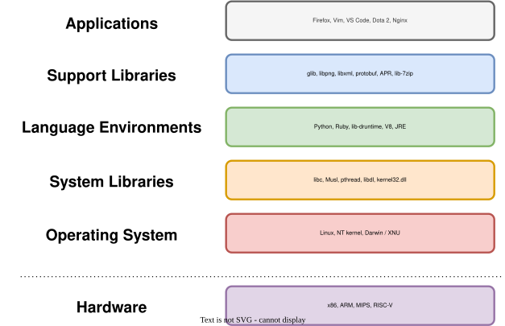

The analogy with the networking stack is exact and worth keeping.
Ethernet does not know what TCP is; TCP does not know what HTTP is; HTTP does not know what your API is.
Each layer offers a service to the one above and uses the service of the one below, and that is what makes it possible to replace Wi-Fi with Ethernet without rewriting a browser.

### Everything here is an interface

The single most useful idea in this lecture is that every horizontal line in that diagram is an **interface**: a promise about what can be asked for and what will happen, made by the layer below and relied on by the layer above.

An interface is valuable exactly in proportion to how little it says about the implementation.

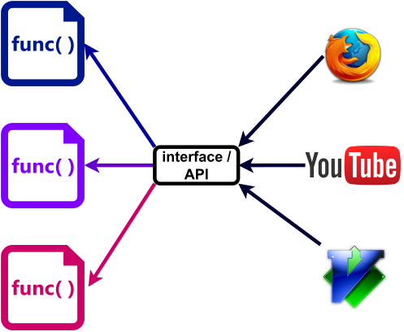

`fopen()` is the same call whether the file is on an SSD, on a USB stick, or on a network filesystem three buildings away.
`write()` is the same call whether the file descriptor is a file, a pipe, a socket or a terminal.
That is not a convenience; it is what lets the kernel add a new filesystem without anyone recompiling anything.

### The same message from five heights

The demo in [`demos/02-software-stack/`](demos/02-software-stack) prints `Hello, World!` six ways, and counts what each one costs.

```text
$ make strace
./hello-nolibc         2 system calls
./hello-asm            30 system calls
./hello-c              35 system calls
./hello-cpp            65 system calls
python3 hello.py       6155 system calls
```

| Version | Size | Shared libraries | Start-to-exit |
| --- | ---: | ---: | ---: |
| assembly, no libc | 8 888 B | 0 | ≈ 0.25 ms |
| assembly, via libc start-up | 15 712 B | 1 | ≈ 0.35 ms |
| C, `puts()` | 16 032 B | 1 | ≈ 0.35 ms |
| C++, `std::cout` | 16 568 B | 4 | ≈ 0.70 ms |
| Python, `print()` | -- | -- | ≈ 32 ms |

The freestanding assembly version makes exactly two system calls: the `execve()` that started it, and the `write()` that does the work.
The C version makes thirty-five, of which thirty-four are the dynamic loader finding `libc.so.6` and libc setting up standard streams before `main()` is entered.
Python makes six thousand, nearly all of them the interpreter finding its own modules.

And yet nobody writes the two-system-call version.
It has no buffering, no formatting, no error handling, no portability beyond x86-64 Linux, and nothing to build on the first time it needs to read a file.
The thirty-three extra system calls buy all of that, once, at start-up.

This is the trade-off the whole lecture is about, and here it is as a measurement rather than an opinion.

### Where do you build?

Applications can be written at any level: straight on the system call API, on libc, on a language runtime, on a framework.
The higher you start, the more you get for free and the less you control; the lower you start, the more you control and the more you have to build.

A useful rule of thumb: start as high as you can, and move down only where a measurement tells you to.
Most programs never need to move.
The ones that do -- a database, a network stack, a game engine, an operating system -- move down in one specific place, not everywhere.

> **Takeaway.**
> There is a stack, and it exists so that new software can be built out of existing software.
> Higher up: faster to write, more choices, more provided for you.
> Lower down: more control, better performance, more of the work is yours.

## 03. The Operating System

### What it is for

The operating system is the first layer of software above the hardware, and it exists to do three things that no application can do for itself.

* **Management.**
  Someone has to decide which process gets the CPU next, which physical memory backs which virtual address, and what is on the disk where.
* **Arbitration.**
  There are many programs and one machine.
  Someone has to keep them out of each other's memory, share the disk between them, and stop one of them from bringing down the rest.
* **System services.**
  Creating a process, opening a file, sending a packet, allocating memory: the operations every program needs and none of them should reimplement.


### The system call interface

The kernel's API is the **system call API**.
It is what a program uses to ask the kernel to do something, and it divides into a handful of families:

| Family | Examples | Lecture |
| --- | --- | --- |
| process and thread management | `fork()`, `execve()`, `wait()`, `clone()` | 06--08 |
| memory management | `brk()`, `mmap()`, `munmap()` | 03--05 |
| file I/O | `open()`, `read()`, `write()`, `close()` | 09--10 |
| network I/O | `socket()`, `connect()`, `send()`, `recv()` | 11 |
| inter-process communication | pipes, signals, shared memory | 10, 12 |

Linux has a few hundred of them.
The complete list of numbers is in `/usr/include/x86_64-linux-gnu/asm/unistd_64.h`, and `man 2 syscalls` is the index.

Almost nothing calls them directly.
Programs call `fopen()`, `printf()` and `malloc()`, and libc turns those into `openat()`, `write()` and `mmap()` when and only when it has to.

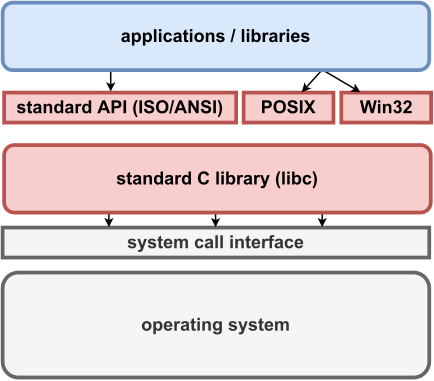

There are three standards layered on top of one another here, and it is worth keeping them apart:

* **ANSI / ISO C** is the portable core: `printf()`, `fopen()`, `malloc()`, `strlen()`.
  It exists on every platform with a C compiler, including ones with no operating system at all.
* **POSIX** is the UNIX interface: `open()`, `fork()`, `pthread_create()`, `socket()`.
  It is what makes it plausible to move a program between Linux, the BSDs and macOS.
* **The Windows API** is the same job done differently: `CreateFile()`, `CreateProcess()`, `VirtualAlloc()`.

### Why a system call is not a function call

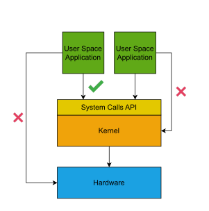

A library call is a jump to another address in your own program, costing a few nanoseconds.
A system call is a request to code that runs with different privileges, in a different address space layout, under different rules.

The processor has (at least) two modes.
**User mode** runs application code and cannot touch device registers, page tables or another process's memory.
**Kernel mode** can do all of that.
The only way from one to the other is through a controlled entry point: on x86-64, the `syscall` instruction, which switches mode and jumps to one fixed address the kernel chose at boot.

That controlled entry point is the whole security architecture in one sentence.
A program cannot reach the kernel anywhere except where the kernel is expecting it, which is why the kernel can check every request before performing it.
In security terms the kernel is a **reference monitor**: every access to a protected resource goes through it, and it cannot be bypassed.

This also means a system call costs more than a function call -- the mode switch, the argument checks, the cache and TLB effects add up to hundreds of nanoseconds rather than a few.
That is not waste.
It is the price of the check.
And it is why `printf()` buffers: the cheapest system call is the one you do not make.

| Library call | System call |
| --- | --- |
| provided by a library | provided by the kernel |
| flexible, many of them, diverse | specific, standardised, few |
| an ordinary function call | a mode switch |
| standard C calling convention | its own calling convention |
| generally portable | specific to the operating system |

### The kernel is a library, not a process

This is the part that most often needs saying twice.

The kernel is not a program that runs alongside yours, taking turns.
It is code that runs *when called*, in two situations only:

1. A process makes a system call, and the kernel runs **on behalf of that process**, in that process's context, using its own stack.
1. A device raises an interrupt, and the kernel runs to handle it.

Between those, the kernel is not running at all; it is a pile of instructions and data structures sitting in memory.
`ps` shows no process for it because there is no process to show.
Thinking of it as a privileged library that is always linked in, rather than as a program, makes almost everything about the next eleven lectures easier.

The internals -- how scheduling decides, how paging works, how the file system is laid out -- are the rest of the course.
Lecture 02 takes the kinds of operating system in turn.

> **Takeaway.**
> The operating system manages resources, arbitrates between programs, and offers services through the system call API.
> It is privileged, it is entered only through controlled entry points, and it runs on behalf of processes rather than beside them.

## 04. Trade-offs: What a Layer Costs You

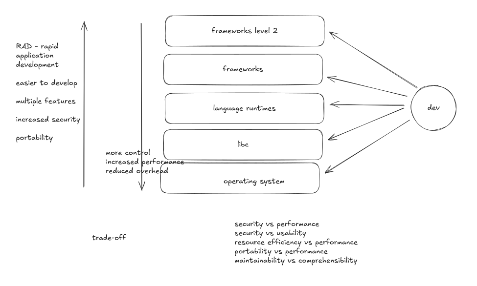

Moving up the stack buys rapid development, more features, better portability and usually better security.
Moving down buys control, performance and lower overhead.
Neither direction is correct; the direction depends on what you are building.

Five trade-offs come up again and again.

### Portability against performance

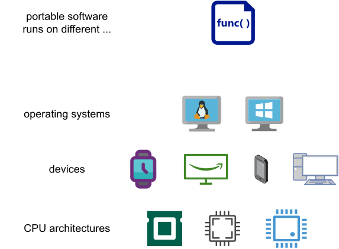

A portable implementation is written once against an interface that many platforms provide.
A specific implementation is written against one platform and can use everything that platform offers.

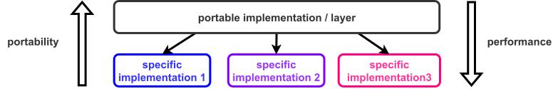

The same Fibonacci computation in C and in Python differs by one to two orders of magnitude, and the Python version runs unchanged on anything CPython runs on.
The same choice appears inside single programs: a generic `memcpy()` against an AVX-512 one, a portable SQL query against a PostgreSQL-specific one.

The usual resolution is not to choose but to layer: write the portable version, and add a specific implementation behind the same interface where it pays.
That is what libc does with `memcpy()`, selecting an implementation at load time based on what the CPU supports.

### Resource efficiency against performance

Buffering trades memory for time.
Copying a file with a 1-byte buffer makes one system call per byte; with a 64 KB buffer it makes one per 65 536 bytes and finishes thousands of times faster, at the cost of 64 KB.
Make the buffer 1 GB and you have spent a gigabyte to save nothing, because the gain flattened out long before.

The same shape appears in caches, connection pools, thread pools and pre-allocated arenas.
There is always a point past which more memory buys no more speed, and finding it is measurement, not reasoning.

This is exactly the argument the first lab session makes with `printf()` against `write()`.

### Security against performance

The demo in [`demos/04-versus/`](demos/04-versus) hashes the same password a million times with djb2 and with SHA-256:

```text
simple hash (djb2)    0.032593 s for 1000000 iterations
secure hash (SHA-256) 0.697281 s for 1000000 iterations
SHA-256 costs 21.4x as much per hash.
```

Twenty-one times slower, and that slowness *is* the security property: the 64 rounds of mixing are what makes the function hard to run backwards.

The interesting part is that for storing passwords, both are wrong.
SHA-256 is far too fast -- an attacker with a stolen database tries billions of candidates per second on a GPU -- so the right answer is bcrypt, scrypt or Argon2, which are *deliberately* slowed down to around 100 ms per hash.
There the slowness is not a cost to be minimised; it is the product.

The same trade-off is everywhere in systems work: bounds checking, stack canaries, ASLR, `mprotect()` on JIT pages, and the Spectre and Meltdown mitigations that cost real percentage points of throughput.

### Security against usability

Every security mechanism a user meets is a mechanism they can find annoying enough to disable.
Two-factor authentication, password rotation, confirmation dialogs, `sudo` prompts, signed binaries.

The failure mode is specific and worth naming: a control that is too costly to use gets routed around, and a routed-around control protects nothing while still appearing on the compliance checklist.
Forced 90-day password rotation is the classic example -- it was standard advice for twenty years, and it was withdrawn because it reliably produced `Summer2024!` followed by `Autumn2024!`.

### Maintainability against comprehensibility

Code that is easy to change is not always code that is easy to read.
An abstraction layer, a plugin system, a table of function pointers: each of them makes the next change cheaper and the current control flow harder to follow.

The Linux kernel is full of this.
A call to `file->f_op->read_iter()` is three characters of indirection that let a hundred filesystems share one code path, and it also means you cannot tell what runs next without knowing which filesystem you are on.
The indirection is right; it is still a cost, paid by every person who reads the code afterwards.

> **Takeaway.**
> Every one of these is a choice about which cost you are willing to pay, and the answer depends on the system.
> "Which is better?" has no answer; "which cost am I choosing to pay, and who pays it?" always does.

## 05. Applications and Libraries

### Two kinds of software component

All software provides services.
The difference between the two kinds is who asks for the service and how.

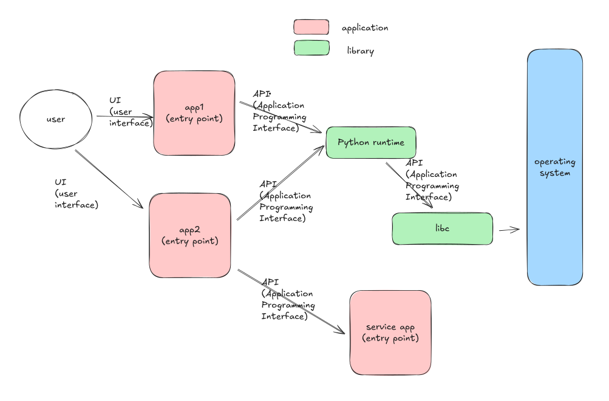

An **application** has an **entry point** -- `main()`, `_start`, a `__main__` block -- and is started.
Something outside it decides to run it: a user clicking, a shell command, a service manager, another program.

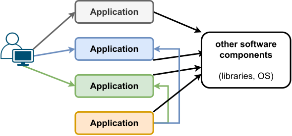

A **library** has no entry point.
It has an **interface**: a set of functions, types and constants that other code calls.
It never runs on its own; it runs because something linked against it called into it.

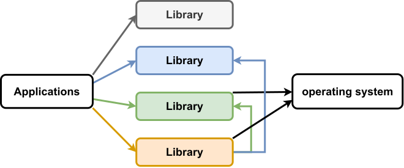

### What they have in common

Under the surface they are the same kind of object, which is why the distinction is worth stating carefully.

Both are compiled to machine code, both have `.text`, `.rodata`, `.data` and `.bss` sections, both are ELF files on Linux, and both are stored as files in the filesystem.
On many systems the *same* file can be both: `libc.so.6` is a shared library, and running it directly prints its version banner, because it has an entry point too.

| Application | Library |
| --- | --- |
| entry point (`main`, `_start`) | exposed interface (API) |
| usable | reusable |
| bound at load time | bound at link time or load time |
| started by a user or by the system | called by another program |

### Applications with APIs

The line is not a wall.
An application can expose an API as well as a UI: a database accepts queries, a web server accepts HTTP requests, `git` can be driven by a script.

What makes something an application is that it is *started* and has a life of its own; what makes something a library is that it is *called*.
A component can do both, and a great many do -- which is the bridge to the last part.

### Frameworks

A framework is a library with opinions about the shape of your program.

With a library, your code calls it: you decide the control flow, and you call `sqlite3_exec()` when you want a query run.
With a framework, it calls your code: Flask owns the loop that accepts requests, and your function runs when a request matches a route you declared.

That inversion is the whole difference, and it is why a framework is much harder to leave than a library.
You can swap one JSON library for another in an afternoon; you cannot swap Django for Rails at all.

> **Takeaway.**
> Applications have entry points and are started; libraries have interfaces and are called.
> Both provide services, both are ordinary files of machine code, and the same file is sometimes both.

## 06. Interaction between Software Components

### Everything exposes an interface


Whatever a software component is, it offers an interface, and the kind of interface follows from who is on the other side.

* A **UI** -- command line, terminal UI, graphical, web -- when the other side is a person.
* An **API** when the other side is code in the same process: a library called by an application, or by another library.
* A **protocol** when the other side is a different process, possibly on a different machine, possibly written in a different language by different people.
  The implementation of a protocol between applications is what is usually called **IPC**, inter-process communication -- inter-*application* communication would be the more accurate name.

A protocol is a much harder interface to design than an API, and for a specific reason: the two ends are built separately, released separately, and fail separately.
A function call cannot half-happen.
A message can be truncated, duplicated, delayed for a minute, or arrive after the process that sent it has exited.
Everything awkward about distributed systems is already present in this distinction.

### A web application, end to end

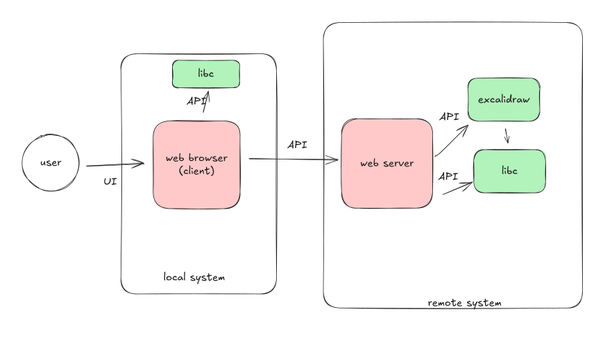

Follow one page load.
A user clicks in a browser -- that is a UI.
The browser builds an HTTP request and sends it through a socket -- that is a protocol, and the browser reached the socket through libc, which reached it through the kernel.
A web server on another machine accepts the connection, and hands the request to an application.
That application queries a database over a second protocol.
The database reads a row through libc, through the kernel, off the page cache.
The answer travels back up the same path.

Every box in that picture is a stack in its own right.
Zoom in on the database and you get the diagram from part 02 again, with MariaDB where the application was.

The demo in [`demos/06-software-interaction/`](demos/06-software-interaction) is exactly this, as four containers you can start with one command: nginx, PHP-FPM running WordPress, MariaDB, and phpMyAdmin.
Four components, three protocols, one UI.

The payoff is replaceability.
phpMyAdmin works against MariaDB because it speaks the same wire protocol; nginx can be swapped for Apache; MariaDB for MySQL.
None of them knows anything about the others beyond an interface, which is why each of them can be replaced without touching the rest.

> **Takeaway.**
> Components interact through interfaces: a UI for people, an API for code in the same process, a protocol for code in another one.
> Protocols are the hard case, because both ends are built and released independently.

## 07. Conclusion

The lecture covered:

* the software stack, and what each layer provides to the layer above it
* the role of the operating system, and the system call API it exposes
* the trade-offs that decide how high in the stack to write something
* applications and libraries, and what actually separates them
* interaction between software components, through UIs, APIs and protocols

If one thing survives the week, make it this.

> **Takeaway.**
> Software is built in layers, and every layer is an interface that hides an implementation.
> Understanding a layer below yours is what turns a surprising measurement into a decision you can defend.

The four programs from the pitch are the same point in four disguises.
The `strcat()` loop is an interface that cannot carry a length.
The segmentation fault is a compiler, a linker and a kernel agreeing about what is writable.
The fast second `find` is a kernel that remembers.
The quadratic Python loop is an optimisation that is not part of the contract.

In each case the source code was correct and useless as a cost model, and the explanation was one layer down.
That is what you gain from this course: not the ability to write an operating system, but the ability to know which layer to look at.

## Where this goes next

* **Lecture 02** takes the operating system apart: kinds of kernel, and the interface each of them offers.
* **Lab 01** turns part 02 and part 03 into practice: implementing libc string functions, measuring buffered against unbuffered output, and building the same program as a static and a dynamic executable.
  Start at [`labs/01-software-stack-full/`](../../labs/01-software-stack-full).

## References

### Standards and manuals

* [ISO C standard](https://www.iso-9899.info/wiki/The_Standard)
* [POSIX](https://pubs.opengroup.org/onlinepubs/9699919799/) -- the Open Group base specifications
* [Windows API index](https://learn.microsoft.com/en-us/windows/win32/apiindex/windows-api-list)
* `man 2 syscalls`, `man 2 syscall`, `man 7 libc`

### Books

* Remzi and Andrea Arpaci-Dusseau, [*Operating Systems: Three Easy Pieces*](https://pages.cs.wisc.edu/~remzi/OSTEP/) -- free, and the best first book on the subject
* Michael Kerrisk, *The Linux Programming Interface* -- the reference for the POSIX and Linux system call API
* Randal Bryant and David O'Hallaron, *Computer Systems: A Programmer's Perspective* -- the layer below this lecture

### Worth reading

* Joel Spolsky, [*The Law of Leaky Abstractions*](https://www.joelonsoftware.com/2002/11/11/the-law-of-leaky-abstractions/) -- why a layer never hides everything
* Joel Spolsky, [*Back to Basics*](https://www.joelonsoftware.com/2001/12/11/back-to-basics/) -- where the `strcat()` demo comes from
* [What every programmer should know about memory](https://people.freebsd.org/~lstewart/articles/cpumemory.pdf), Ulrich Drepper
* [Linux ate my RAM](https://www.linuxatemyram.com/) -- the page cache, in one page
</content>
