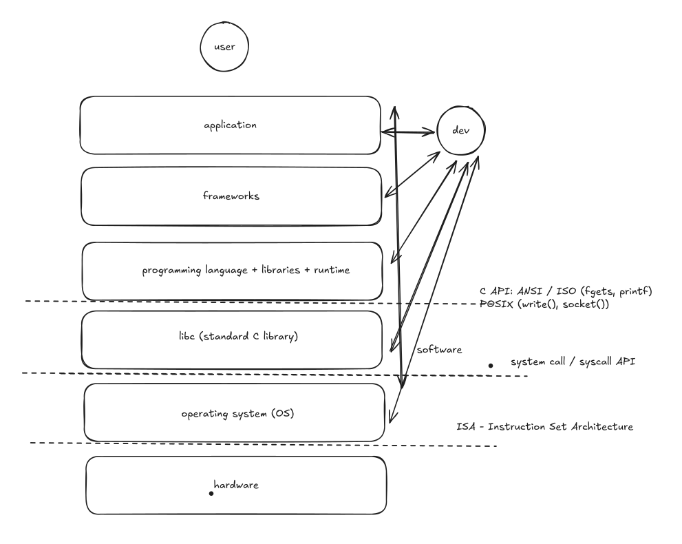
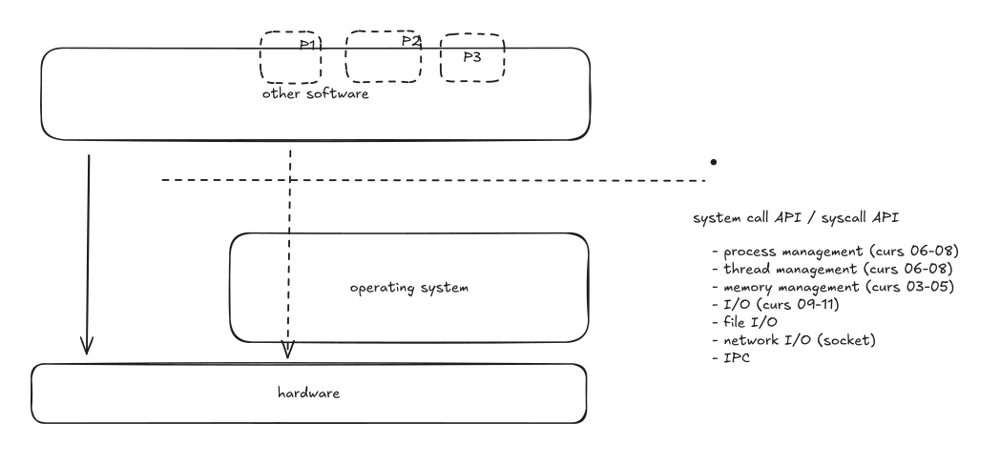
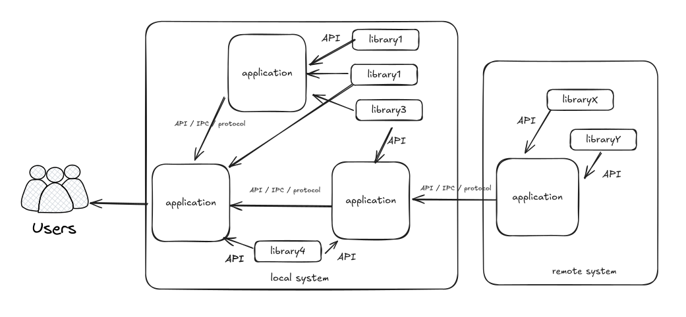

## Four small programs {background-color="#f7f7f7"}

```text
strcat() x4          309604 us        strcpy() at known offsets   10475 us

char *str = "..."    segfault         char str[] = "..."          works

find /usr/share      2.66 s           the same command again      0.18 s

s = s + "a"          O(N)             keep = s; s = s + "a"       O(N^2)
```

Same output. Same machine. Same library.

::: {.notes}
Run `01-copy-string` and `03-find-buffer-cache` live.
Describe the other two from the slide.
Keep it under twelve minutes.
:::

## {background-color="#f7f7f7"}

::: {style="font-size: 1.35em; text-align: center; margin-top: 2em;"}
You do not need to know everything that is under you.

You need to know **that** something is under you,
roughly what it does,
and where to look when the numbers stop making sense.
:::

## Today

1. What are the **layers**?
1. What is the **operating system**?
1. What does a layer **cost**?
1. **Applications** and **libraries**?
1. How do components **interact**?

## The stack

{fig-align="center" width="60%"}

## Every horizontal line is an interface

ISA · system call API · C API · language API · framework API · UI

An interface is a promise about **what**.

It is valuable in proportion to how little it says about **how**.

::: {.notes}
`fopen()`: SSD, USB stick, network filesystem.
`write()`: file, pipe, socket, terminal.
That is what lets the kernel add a filesystem without anyone recompiling.
:::

## Demo: the same message, five heights

```text
./hello-nolibc         2 system calls        8 888 B     0.25 ms
./hello-asm            30 system calls      15 712 B     0.35 ms
./hello-c              35 system calls      16 032 B     0.35 ms
./hello-cpp            65 system calls      16 568 B     0.70 ms
python3 hello.py     6155 system calls           ---       32 ms
```

All five end in the same `write()`.

**So why does nobody write the first one?**

::: {.notes}
`make strace` in demos/02-software-stack.
Then `strace ./hello-nolibc` -- three lines.
No buffering, no formatting, no error handling, no portability, nothing to build on.
:::

## The operating system

{fig-align="center" width="85%"}

Management · arbitration · system services

## System calls

| Family | Examples | Lecture |
| --- | --- | --- |
| processes and threads | `fork()`, `execve()` | 06--08 |
| memory | `brk()`, `mmap()` | 03--05 |
| file I/O | `open()`, `read()`, `write()` | 09--10 |
| network I/O | `socket()`, `connect()` | 11 |
| IPC | pipes, signals, shared memory | 10, 12 |

`man 2 syscalls` · almost nothing calls them directly

## One door

**User mode**: cannot touch device registers, page tables, another process's memory.

**Kernel mode**: can.

Across: the `syscall` instruction, to one address the kernel chose at boot.

*A mode switch costs hundreds of nanoseconds. That is the price of the check --- and the reason libc buffers.*

## The kernel is a library, not a process

It runs **when called**:

* a process makes a system call --- and the kernel runs *on behalf of that process*
* a device raises an interrupt

Between those, it is not running at all.

**Where is it in `ps`?**

## Trade-offs

{fig-align="center" width="72%"}

## Demo: what a guarantee costs

```text
djb2       0.032593 s per million hashes
SHA-256    0.697281 s per million hashes      21.4x
```

The slowness **is** the security property.

For *storing* passwords, both are wrong --- SHA-256 is too **fast**.

::: {.notes}
bcrypt, scrypt, Argon2 are deliberately slowed to about 100 ms.
There, slowness is the product.
Mention the other four trade-offs in one sentence each.
:::

## Applications and libraries

{fig-align="center" width="72%"}

An **entry point**, and something that starts it · an **interface**, and something that calls it

## Interaction

{fig-align="center" width="78%"}

**UI** a person · **API** the same process · **protocol** a different one

## {background-color="#f7f7f7"}

::: {style="font-size: 1.3em; text-align: center; margin-top: 2em;"}
Software is built in layers,
and every layer is an interface that hides an implementation.

Understanding the layer below yours is what turns
a surprising measurement into a decision you can defend.
:::
